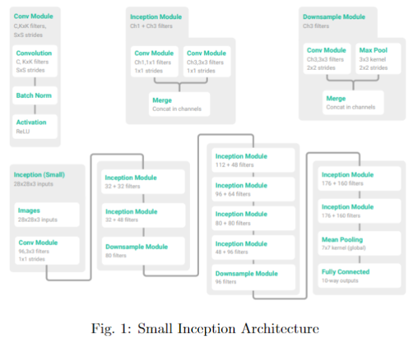
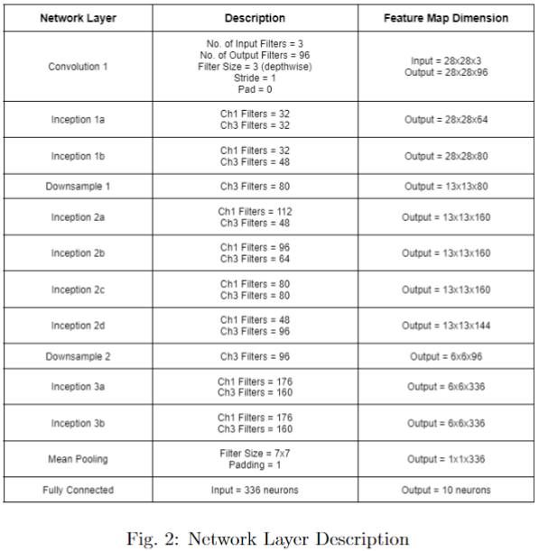
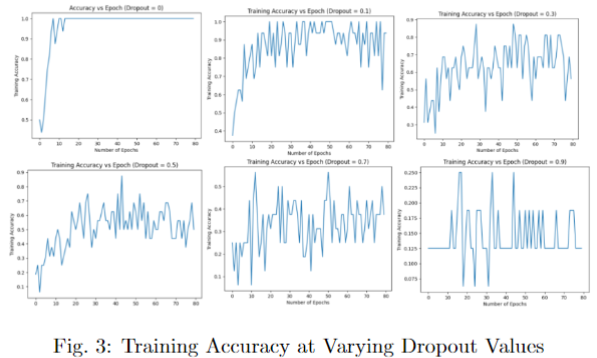
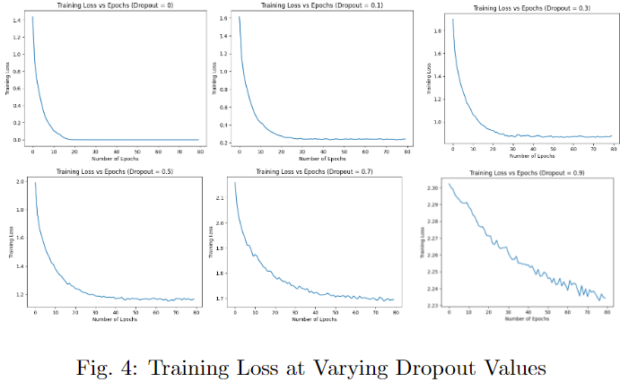
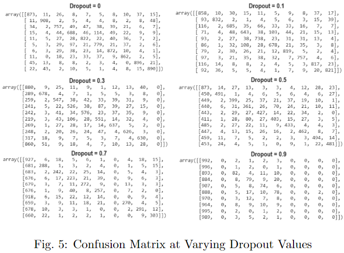
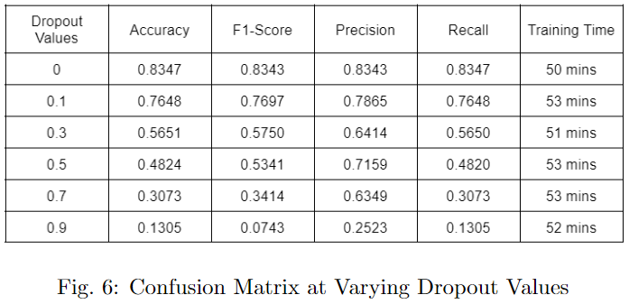

# MiniGoogleNet
GoogleNet architecture is a state-of-the-art convolutional neural network model that paved the way last 2014 in the ImageNet Large-Scale Visual Recognition Challenge (ILSVRC14) that solved image classification and detection problems. It is composed of 22-layer deep convolutional neural networks developed by the researchers at Google. A mini version of GoogleNet called small inception model will be implemented in this exercise. It consists of 13 layers but with substantial decrease in its dimension per layer.

# Methodology
## Dataset Preparation and Preprocessing
The dataset that will be used is the [CIFAR-10 Dataset](https://www.cs.toronto.edu/~kriz/cifar.html). It consists of 60000 32x32 colored images of which, 50000 will be on the training dataset and the rest will be on the testing dataset. There are ten (10) labels/classes on the dataset namely; airplane, automobile, bird, cat, deer, dog, frog, horse, ship, and truck. The labels are mutually exclusive meaning, there is no overlapping between two different labels [1].

For the preprocessing steps, the image equivalent 32x32x3 matrix shape will be scaled to [0,1] by dividing all pixel values by 255. It will then be cropped, from the center, to form a 28x28x3 image. Lastly, image normalization will be performed per individual image by subtracting all pixel values by the mean, and dividing it by the standard deviation.
## Machine Learning Training and Evaluation
Small inception module will be used as the main model for training of the CIFAR-10 dataset. Fig. 1 shows the architecture of the small inception module adapted from [2]. Here, a series of inception modules are applied. This is vital since each inception module parallelizes two convolution blocks with different parameters to capture multiple features at once [3].Note that the convolution module with channel 3 utilizes a full padding of 1 to retain its initial dimension (non-depth) since this module has filter size of 3x3 and stride of 1 which decreases the dimension. Full padding of 1 adds additional 2 pixels end to end which retains the dimension of the feature map.

The feature map dimensions after each network layer are summarized in Fig. 2. Note that all convolution modules preserve non-depth dimensions, and its new depth is obtained using the number of output filters of the module. Furthermore, the inception module consists of two parallel convolutional modules hence, its non-depth dimension is also preserved. The depth of each inception module is the sum of the number of filters of the two parallel convolutional blocks. For instance, Inception 2c has a depth of 160 since the number of filters in its two parallel convolutional blocks are each 80. The downsampling module reduces its non-depth dimension by a factor of 2.

The training dataset, with 50000 images, will be subjected to the small inception module. The parameters are as follows:
1.  Optimizer: Stochastic Gradient Descent
2.  Learning Rate: 0.01
3.  Learning Rate Scheduled: Linearly Decayed
4.  Number of Epochs: 80
5.  Batch Size: 16

Batch size is set to a smaller value to save memory at the expense of training time. Free version of Google Colab will be used in training the model. It uses the cloud TPU with 180 teraflops of computation, Intel Xeon processor with two cores at 2.30 GHz and 13 GB RAM [4]. After training of the model, evaluation on the training dataset will be performed. Training Accuracy vs Epoch as well as Training Loss vs Epoch will be observed at varying dropout values. Dropouts of 0, 0.1, 0.3, 0.5, 0.7, and 0.9 will be considered in the exercise.
## Performance Testing
For performance evaluation on the unseen dataset, testing dataset will be subjected to the trained model. Since the dataset is balanced, accuracy can be enough as the performance metric to be used. However, we will also consider checking the macro F1-score, Precision, and Recall for explainability of results. Macro metrics will be used since the dataset consists of multiple labels. Here, macro metric is equivalent on getting the average of individual metric per labels, treating other labels as "others" (one versus rest).
# Results and Discussion
Shown in Fig. 3 and 4 the training accuracy and training loss respectively, vs number of epochs for each dropout value. As the dropout value increases, the training accuracy becomes unstable and it drops significantly. Meanwhile, training loss doesn’t converge to small values and becomes unstable too as dropout increases. This can be attributed to lack of training epochs considered for higher dropout value since the model fails to train enough, giving low accuracy and high loss. 

Confusion matrices at varying dropout values were summarized in Fig. 5. Here, the correct predictions can be observed in the diagonal part of each matrix. It can be observed that at no dropout value applied, there are more instances of correct predictions. Significantly low number of correct predictions can be observed at higher dropout values.

To summarize the performance metrics of the inception model, Accuracy, F1-Score, Precision, Recall, and training time were obtained for each dropout value as shown in Fig. 6. Here, the metrics were obtained in the test dataset, for generalization purposes. As supporting proof, the metrics obtained were good at no dropout, but it significantly decreases when the dropout value increases. It can be attributed to lesser training epochs of the model with a high dropout. No significant difference was observed for training time  at varying dropout since dropout is only used for overfitting issues.

# Conclusion
In this exercise, a small inception model was used to discriminate labels of the CIFAR-10 dataset. It can be observed that at a fixed learning rate, increasing the dropout value decreases the performance metrics of both the training accuracy, losses, and the testing metrics such as accuracy, f1-score, precision, and recall. Furthermore, training time doesn’t factor out much at varying dropout rates. This is expected since dropout is only used to avoid overfitting upon generalization in the testing dataset.

# References
[1]  A. Krizhevsky, “CIFAR-10 and CIFAR-100 datasets,” Toronto.edu, $2009$. https://www.cs.toronto.edu/~kriz/cifar.html

[2]  C. Zhang, S. Bengio, M. Hardt, B. Recht, and O. Vinyals, “Understanding deep learning requires rethinking generalization,” arXiv:1611.03530 [cs], Feb. 2017, Available: https://arxiv.org/abs/1611.03530

[3]  “Inception Module,” DeepAI, May 17, 2019. https://deepai.org/machine-learning-glossary-and-terms/inception-module: (accessed Dec. 26, 2023).

[4]  “Use Google Colab for Deep Learning and Machine Learning Models,” Analytics Vidhya, Mar. 22, 2020. https://www.analyticsvidhya.com/blog/2020/03/google-colab-machine-learning-deep-learning/
